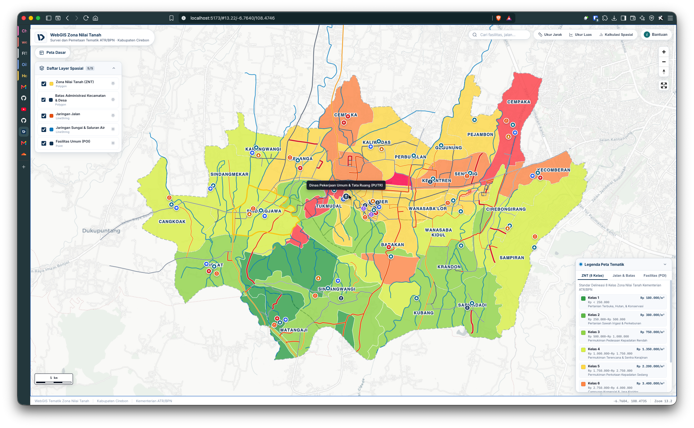
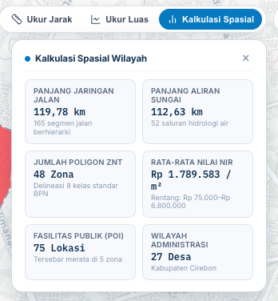
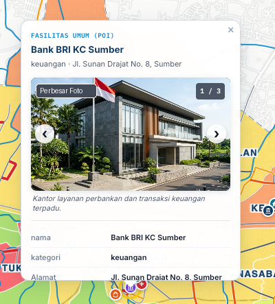
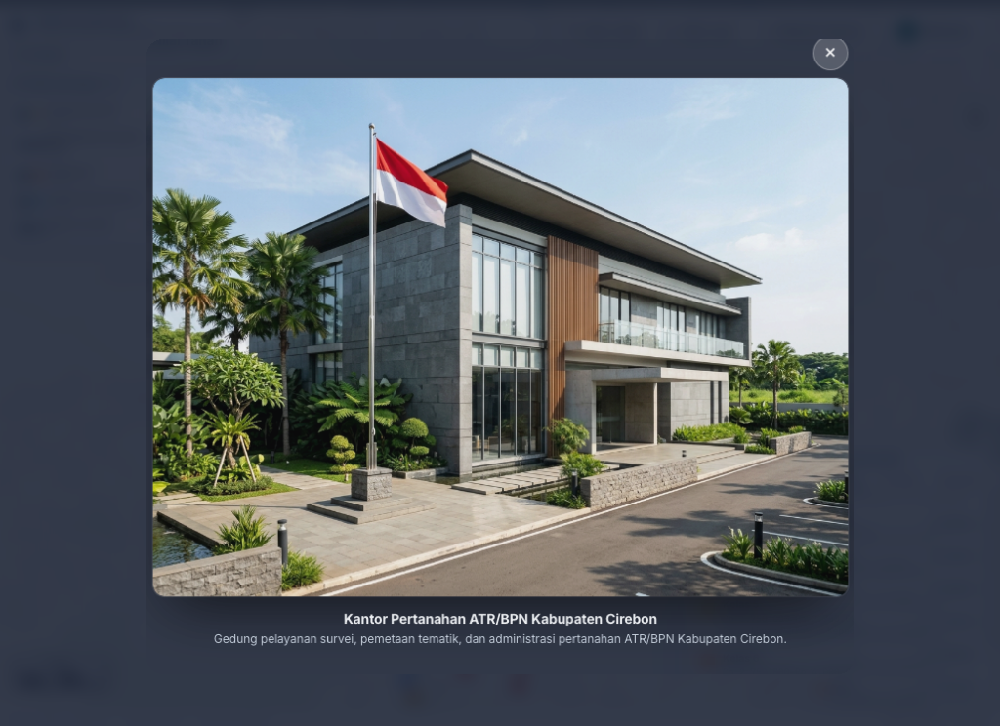

# WebGIS Tematik Zona Nilai Tanah (ZNT) Kabupaten Cirebon

Portal WebGIS statis modern berbasis WebGL berperforma tinggi untuk visualisasi interaktif Zona Nilai Tanah (ZNT) Kementerian Agraria dan Tata Ruang / Badan Pertanahan Nasional (ATR/BPN), hierarki jaringan jalan, sistem hidrologi sungai, batas administrasi desa, serta 75 titik fasilitas umum strategis di Kabupaten Cirebon.

* **Akses Publik (Live Demo):** [https://webgis-znt-atrbpn.pages.dev](https://webgis-znt-atrbpn.pages.dev/)
* **Pengembang:** Dhany Yudi Prasetyo
* **Portofolio:** [dhanypedia.com](https://www.dhanypedia.com)
* **Kontak Email:** [dhanyyudi.prasetyo@gmail.com](mailto:dhanyyudi.prasetyo@gmail.com)

---

## Tentang Proyek (About)

Portal WebGIS Tematik Zona Nilai Tanah Kabupaten Cirebon dibangun untuk mendemokratisasi akses informasi geospasial tematik pertanahan bagi masyarakat umum, penilai tanah, perencana tata ruang, dan akademisi. Melalui pemanfaatan data terbuka berbasis standar teknis Direktorat Survei dan Pemetaan Tematik Kementerian ATR/BPN, portal ini menyajikan visualisasi zona nilai tanah yang transparan, akurat, dan mudah dipahami.

### Fokus dan Keunggulan Utama
1. **Transparansi Nilai Tanah:** Menyajikan delineasi spasial 8 kelas Zona Nilai Tanah lengkap dengan rentang Nilai Indikasi Rata-rata (NIR) per meter persegi, mulai dari kawasan pedesaan hingga koridor perkotaan primer.
2. **Konektivitas Multitematik:** Mengintegrasikan zona nilai tanah dengan jaringan jalan berhierarki, jaringan sungai drainase, batas wilayah desa, serta fasilitas publik esensial guna memberikan pemahaman kontekstual yang utuh terhadap dinamika wilayah.
3. **Kemandirian Arsitektur Statis:** Seluruh sistem berjalan pada arsitektur web statis murni tanpa server basis data spasial yang berat. Melalui optimalisasi format GeoJSON dan mesin rendering WebGL MapLibre GL JS, portal mampu beroperasi dengan kecepatan 60 bingkai per detik serta memiliki ketahanan uptime tinggi di jaringan Cloudflare Pages.
4. **Alat Analisis Terpadu:** Pengguna tidak hanya melihat peta, namun juga dapat menghitung jarak lintasan jalan dengan formula Haversine, mengukur luas bidang tanah geodesik, mencari objek spesifik, serta menelaah galeri dokumentasi foto lapangan beresolusi tinggi.

---

## Pratinjau Antarmuka Aplikasi

### 1. Peta Utama dan Panel Kendali Geospasial

*Tampilan menyeluruh portal WebGIS memuat layer 8 kelas Zona Nilai Tanah, jaringan jalan, aliran hidrologi, sebaran titik POI berjenjang, bilah navigasi alat ukur, kotak pencarian instan, batang skala kartografis hitam-putih di sudut kiri bawah, serta widget legenda tematik.*

<br/>

### 2. Alat Ukur Spasial dan Kalkulasi Statistik Wilayah

*Panel ringkasan kalkulasi spasial wilayah terpetakan (panjang jalan 119,78 km, panjang sungai 112,63 km, 48 zona delineasi ZNT, nilai indikasi rata-rata Rp 1,79 Juta/m², 75 titik fasilitas publik, dan 27 desa) serta tombol pengukuran jarak Haversine dan luas poligon geodesik.*

<br/>

### 3. Kartu Informasi Objek (Popup Atribut)

*Kartu popup interaktif fasilitas publik dengan galeri foto lapangan multi-slide, informasi atribut lengkap, serta tombol pembesar foto.*

<br/>

### 4. Pratinjau Foto Layar Penuh (Image Lightbox)

*Fitur pembesar gambar (lightbox) berlatar belakang transparan blur untuk menginspeksi dokumentasi visual lapangan secara detail.*

---

## Gambaran Umum Sistem

Portal geospasial ini dirancang untuk menyajikan data tematik pertanahan secara cepat, ringan, dan estetik. Menggunakan arsitektur statis tanpa ketergantungan pada server basis data berat, seluruh data dikemas dalam format GeoJSON teroptimasi dan dirender langsung pada peramban melalui WebGL engine MapLibre GL JS pada kecepatan 60 bingkai per detik.

### Lapisan Data Tematik

1. **Zona Nilai Tanah (ZNT):** 8 kelas nilai tanah resmi berstandar survei tematik ATR/BPN, mulai dari Kelas 1 (nilai terendah: pertanian terbuka dan kawasan konservasi) hingga Kelas 8 (nilai tertinggi: pusat niaga strategis koridor perkotaan).
2. **Batas Administrasi Wilayah:** Delineasi poligon batas desa dan kelurahan di Kabupaten Cirebon dilengkapi label toponimi dinamis.
3. **Hierarki Jaringan Jalan:** Klasifikasi jalan arteri primer, kolektor primer, kolektor sekunder, dan jalan lokal dengan pewarnaan kartografis tematik.
4. **Jaringan Hidrologi Sungai:** Aliran sungai utama dan saluran drainase pengairan wilayah.
5. **Fasilitas Publik Strategis (POI):** 75 titik sebaran kantor pemerintahan, kantor pertanahan, balai desa, fasilitas kesehatan, institusi pendidikan, sarana peribadatan, dan pusat perekonomian daerah.

---

## Fitur Utama

* **Pencarian Cepat Spasial:** Input pencarian instan untuk menemukan fasilitas publik, koridor jalan, atau wilayah desa dengan animasi terbang kamera (`flyTo`) dan penyorotan otomatis pada objek terpilih.
* **Pengukuran Jarak dan Luas Geodesik:** Alat ukur interaktif di atas kanvas peta menggunakan formula Haversine untuk jarak lintasan dan kalkulasi luas area poligon geodesik.
* **Kalkulasi Spasial Wilayah:** Dashboard statistik instan yang menghitung agregat panjang jalan, saluran hidrologi, sebaran kelas nilai tanah, serta sebaran fasilitas publik.
* **Skala Kartografis Standar:** Batang skala grafis hitam-putih berstandar kartografi resmi di sudut kiri bawah peta untuk kemudahan estimasi jarak lapangan.
* **Simbologi Kartografis Adaptif:** Simbol POI berbentuk lingkaran lencana tematik dengan ikon SVG terpadu yang mengecil secara elegan saat zoom-out dan membesar saat zoom-in.
* **Popup Atribut dengan Galeri Foto & Lightbox Zoom:** Setiap titik fasilitas dan poligon nilai tanah memiliki kartu informasi atribut yang rapi. Klik pada foto atau tombol perbesar akan membuka pratinjau layar penuh (lightbox) dengan efek perbesaran dan latar belakang transparan blur.
* **4 Koleksi Peta Dasar (Basemap):** Pengguna dapat berganti antara Carto Positron, Carto Dark Matter, OpenStreetMap Standar, dan Citra Satelit Resolusi Tinggi Esri World Imagery.
* **Kendali Transparansi Layer:** Setiap layer tematik memiliki pengatur transparansi (slider opacity) tersendiri untuk mempermudah analisis tumpang-tindih (overlay) dengan peta dasar.
* **Legenda Tematik Multi-Tab:** Legenda interaktif di sudut kanan bawah menyajikan informasi 8 kelas ZNT beserta kisaran harga pasar per meter persegi, hierarki jalan, dan klasifikasi fasilitas umum.
* **Sinkronisasi URL Hash Dinamis:** Posisi koordinat dan tingkat perbesaran peta tersimpan secara otomatis pada hash URL peramban untuk memudahkan berbagi tautan lokasi.
* **Desain Responsif Mobile:** Antarmuka tertata optimal untuk kenyamanan akses di komputer desktop, tablet, maupun ponsel cerdas.

---

## Arsitektur Teknologi

* **Svelte 5:** Kerangka kerja antarmuka modern dengan reaktivitas berbasis Runes.
* **TypeScript:** Pengetikan statis ketat guna menjamin keandalan kode dan integritas model data spasial.
* **MapLibre GL JS:** Mesin pemetaan WebGL open-source berperforma tinggi.
* **Vite:** Alat build modern untuk kompilasi statis kilat.
* **Vitest:** Pengujian unit otomatis (15 test case) untuk memvalidasi algoritma spasial dan struktur data.
* **Turf.js:** Komputasi analisis geospasial dan perhitungan luas serta panjang geodesik.
* **Cloudflare Pages:** Infrastruktur hosting statis global edge berlatensi rendah.

---

## Struktur Repositori

```text
webgis-atr-bpn/
├── docs/                      # Dokumentasi teknis dan tangkapan layar
│   └── screenshots/           # Gambar tangkapan layar WebGIS resolusi tinggi
│       ├── webgis-atr-bpn-overview.png
│       ├── webgis-atr-bpn-tools.png
│       ├── webgis-atr-bpn-detail.png
│       └── webgis-atr-bpn-lightbox.png
├── public/                    # Aset statis publik
│   ├── favicon.svg            # Monogram logo kartografis
│   ├── images/                # Koleksi foto survei lapangan
│   └── screenshots/           # Cadangan aset tangkapan layar
├── scripts/
│   └── generate_clean_pois.cjs # Skrip kurasi data POI spasial
├── src/
│   ├── app.css                # Desain antarmuka dan variabel warna tema
│   ├── App.svelte             # Komponen utama perakit WebGIS
│   ├── main.ts                # Titik masuk aplikasi Svelte 5
│   ├── env.d.ts               # Definisi tipe TypeScript
│   ├── data/                  # Dataset GeoJSON tematik
│   │   ├── batas-administrasi.geojson
│   │   ├── zona-nilai-tanah.geojson
│   │   ├── jaringan-jalan.geojson
│   │   ├── sungai.geojson
│   │   └── fasilitas-publik.geojson
│   └── lib/
│       ├── components/        # Komponen modular UI Svelte
│       │   ├── BasemapSelector.svelte
│       │   ├── BrandPill.svelte
│       │   ├── FeatureDetailCard.svelte
│       │   ├── HelpModal.svelte
│       │   ├── ImageLightbox.svelte
│       │   ├── LayerPanel.svelte
│       │   ├── LegendWidget.svelte
│       │   ├── MeasureControl.svelte
│       │   ├── MonogramLogo.svelte
│       │   └── SearchControl.svelte
│       ├── map/               # Pengendali pemetaan MapLibre GL JS
│       │   ├── basemaps.ts
│       │   ├── map-controller.ts
│       │   ├── measurement.ts
│       │   └── symbology.ts
│       ├── types/             # Definisi antarmuka TypeScript
│       │   └── gis.ts
│       └── utils/             # Utilitas pemformat angka dan teks
│           └── formatters.ts
├── tests/                     # Pengujian unit otomatis Vitest
│   ├── data-integrity.test.ts
│   ├── formatters.test.ts
│   └── spatial-calculations.test.ts
├── package.json               # Konfigurasi dependensi dan skrip proyek
├── tsconfig.json              # Konfigurasi kompilasi TypeScript
├── vite.config.ts             # Konfigurasi bundler Vite
└── wrangler.jsonc             # Konfigurasi publikasi Cloudflare Pages
```

---

## Panduan Instalasi dan Menjalankan Proyek

### Prasyarat Sistem

* Node.js versi 18 atau versi lebih baru
* Paket manajer pnpm (sangat disarankan) atau npm

### Menjalankan di Lingkungan Lokal

1. Pasang dependensi proyek:
   ```bash
   pnpm install
   ```

2. Jalankan server pengembangan lokal:
   ```bash
   pnpm dev
   ```

3. Buka peramban pada alamat lokal yang tertera (biasanya `http://localhost:5173`).

---

## Pengujian Otomatis (Unit Tests)

Jalankan pengujian unit otomatis untuk memvalidasi algoritma perhitungan spasial, integritas data GeoJSON, dan pemformatan:

```bash
pnpm test:run
```

Seluruh 15 pengujian unit mencakup:
* Perhitungan formula Haversine untuk jarak lintasan jalan
* Algoritma luas poligon geodesik
* Validasi kelengkapan atribut pada setiap GeoJSON layer tematik
* Pemformatan nilai uang rupiah dan luas meter persegi

---

## Kompilasi dan Penerbitan ke Cloudflare Pages

### 1. Membangun Berkas Statis

Jalankan perintah build untuk menghasilkan bundel statis murni:

```bash
pnpm build
```

Hasil kompilasi produksi disimpan pada direktori `dist/`.

### 2. Penerbitan Melalui Cloudflare Pages

1. Hubungkan repositori GitHub ini ke akun Cloudflare Pages Anda.
2. Atur konfigurasi build sebagai berikut:
   * **Framework preset:** `Svelte`
   * **Build command:** `pnpm build`
   * **Build output directory:** `dist`
3. Tambahkan variabel lingkungan `VITE_CARTO_API_KEY` bertipe *Plain text* pada menu Environment Variables di dasbor Cloudflare untuk mengaktifkan lisensi resmi Carto Basemaps.
4. Klik **Save and Deploy**. WebGIS akan aktif secara global pada jaringan edge Cloudflare: [https://webgis-znt-atrbpn.pages.dev](https://webgis-znt-atrbpn.pages.dev/).

---

## Lisensi dan Kontak

Aplikasi ini dikembangkan dan dipelihara oleh:

* **Dhany Yudi Prasetyo**
* **Situs Portofolio:** [dhanypedia.com](https://www.dhanypedia.com)
* **Surel:** [dhanyyudi.prasetyo@gmail.com](mailto:dhanyyudi.prasetyo@gmail.com)
